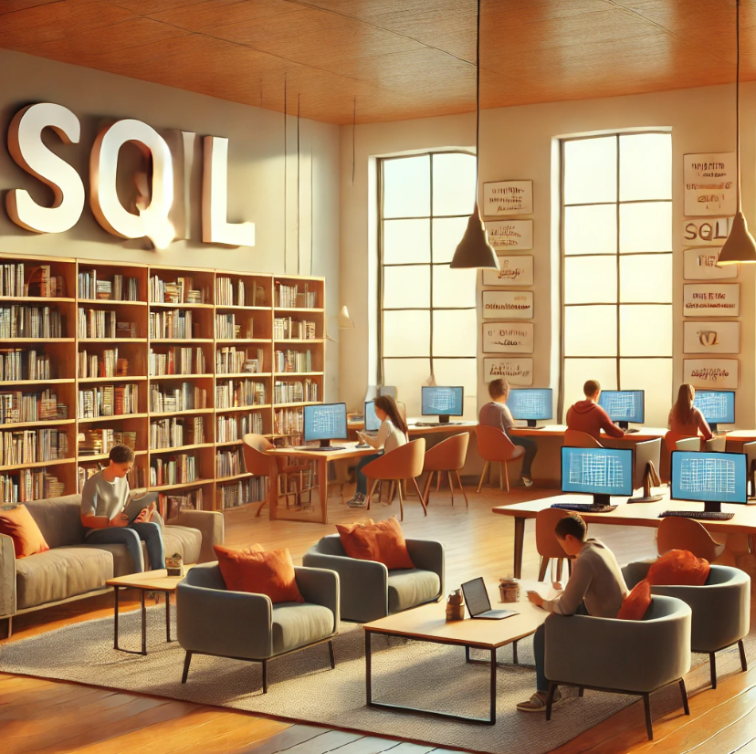

# 
 Cours complet SQL 

    

L'objectif de ce dépôt GitHub est de proposer un cours complet en SQL, adapté à tous les niveaux d'apprentissage. Que vous soyez un étudiant en école d'ingénieur ou un lycéen, ce cours est conçu pour répondre à vos besoins.

Actuellement, certains de ces cours sont spécifiquement adaptés pour être enseignés à des élèves de bac professionnel. L'idée est de fournir un contenu ludique et engageant, particulièrement pour les travaux pratiques (TP), afin de rendre l'apprentissage du SQL aussi agréable que possible.

Ce dépôt ne se limite pas à un simple manuel de cours ; il s'agit d'un projet évolutif visant à offrir un parcours d'apprentissage riche et diversifié, tout en réfléchissant à des méthodes pédagogiques efficaces pour différents niveaux d'étudiants, y compris ceux en lycée professionnel.

# Sources

Voici tous les liens qui m'ont permis de monter ce dépôt github. 

Pour le cours et les TP :
- https://www.coursera.org/learn/sql-data-science?specialization=ibm-data-science
- https://dquenton.forge.apps.education.fr/nsi-terminale-specialite/BaseDeDonnees/BaseDeDonnees00/
- https://github.com/kansiris/SQL-interview-questions/tree/master

Pour le TP numéro 2 : 
- https://mystery.knightlab.com/
- https://www.kaggle.com/datasets/johnp47/sql-murder-mystery-database/
- https://qkzk.xyz/docs/nsi/cours_terminale/bdd/murder_mystery/

Python et le SQL : 
- https://www.easypythondocs.com/SQL.html
- https://docs.python.org/3/library/sqlite3.html

L'ensemble des illustrations a été réalisé avec ChatGPT-4.
